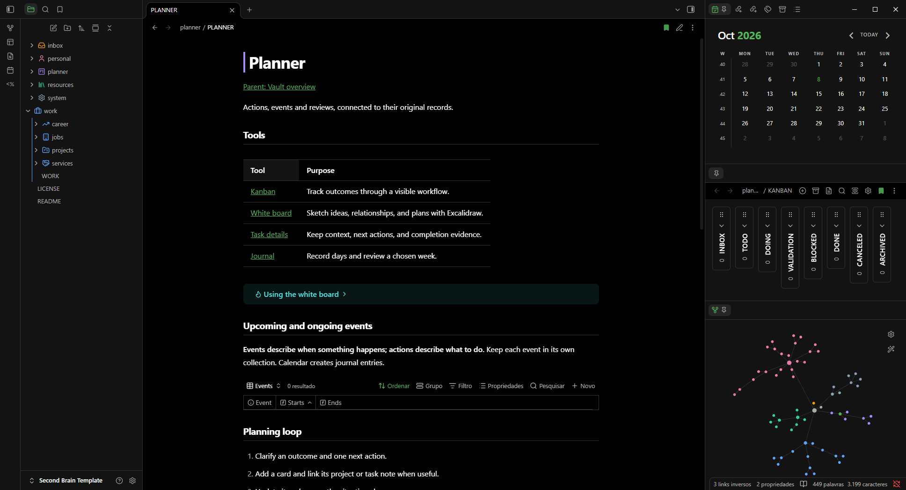

# Your life, thoughtfully organized.

**Second Brain v1.1.0.** A personal Obsidian vault for life records, reusable knowledge, projects and everyday planning.

**[Download](https://github.com/henceenterprise/second-brain/releases/latest)** · **[Quick start](../README.md#quick-start)** · **[Support](https://github.com/henceenterprise/second-brain/issues)**

## A clearer place to start

- Transparent Hence identity for light and dark mode.
- A six-area map, concise guidance in the collection indices and clearer layout instructions.
- Optional editorial styling and presentation controls in **Style Settings → Second Brain**, including separate area colors by theme.
- A real clean-vault overview, matching social preview and editable SVGs.

## Packages

| Asset | Use |
| --- | --- |
| **Second-Brain-v1.1.0.zip** | Extract the vault, including hidden `.obsidian` settings. |
| **Second-Brain-v1.1.0-sources.zip** | Corresponding sources, licenses, provenance and build guidance. |
| **SHA256SUMS.txt** | Compare package checksums before use. |

Download the vault ZIP below. The sources ZIP contains redistribution and maintenance material. Published v1.0.0 assets remain available.

## Make it yours

The optional interface layer adds black/white surfaces and a green accent. In **Style Settings**, adjust each mode's colors, advanced sizes, spacing and corners, or reset them. One **Second Brain** panel groups **Interface** and **Documents**; use native Appearance for scheme, theme and font choices. Disable the interface CSS snippet before using another community theme.

## What stays familiar

Six areas · four layouts · 24 optional topic tags · Bases lists · ISO journals · Kanban · Tasks · drawings · colored Graph.

- Helpers and the six existing community plugins keep their code and versions.
- Style Settings **1.0.9** is added with its GPL-3.0 license and corresponding source material.
- Query code, layout logic, properties, tool destinations, specific icons and Graph area colors are preserved.
- Excalidraw drawings and previews follow Obsidian's light/dark mode.

## Compatibility and care

| Platform | Status |
| --- | --- |
| Windows desktop / Obsidian 1.14.4 | Core and presentation validated. |
| macOS / Linux | Not validated. |
| Mobile | Outside Helpers v1 support. |

Minimum declared Obsidian version: 1.13.0; not every version tested. Update Obsidian and community plugins normally. Helpers checks required interfaces rather than exact versions; a failure pauses only the affected convenience.

**Back up before updating.** Follow [selective updates](UPDATING.md) to preserve personal notes and choices. Canceling a card does not cancel its checkboxes. Session Undo and conservative task deletion are explained in the vault.

No sync, automatic backup or AI is included. Helpers is optional bundled code, separate from the community catalogue. Maintenance has no guaranteed schedule.

Created by **Hence** · [MIT](../LICENSE.md) for template and Helpers · [Plugin licenses and sources](THIRD-PARTY-NOTICES.md).

[Support](https://github.com/henceenterprise/second-brain/issues) · [Private security guidance](SECURITY.md) · [Maintenance](MAINTENANCE.md).
